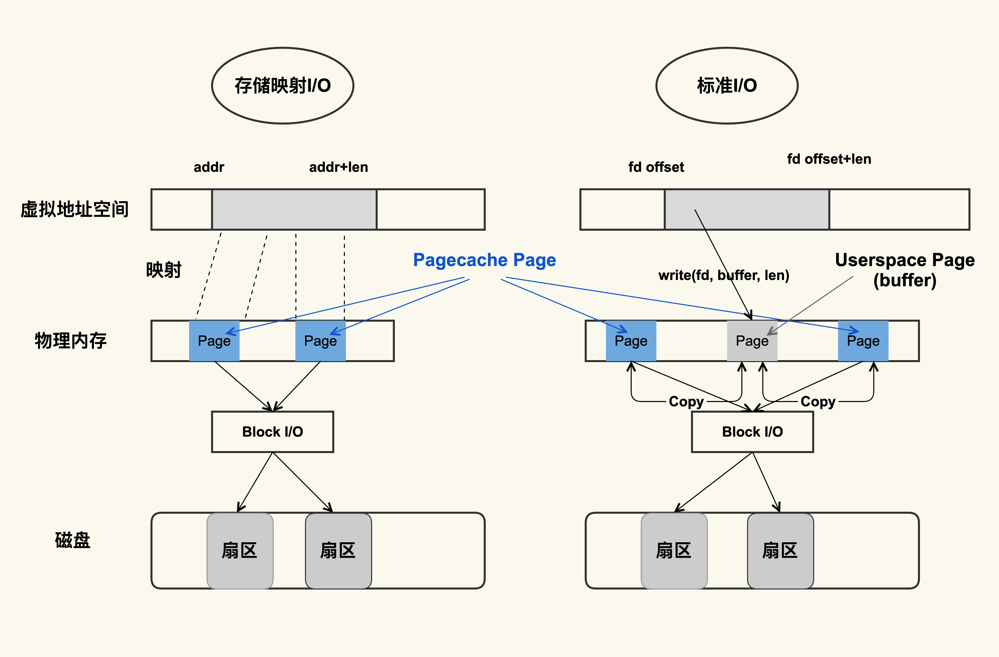
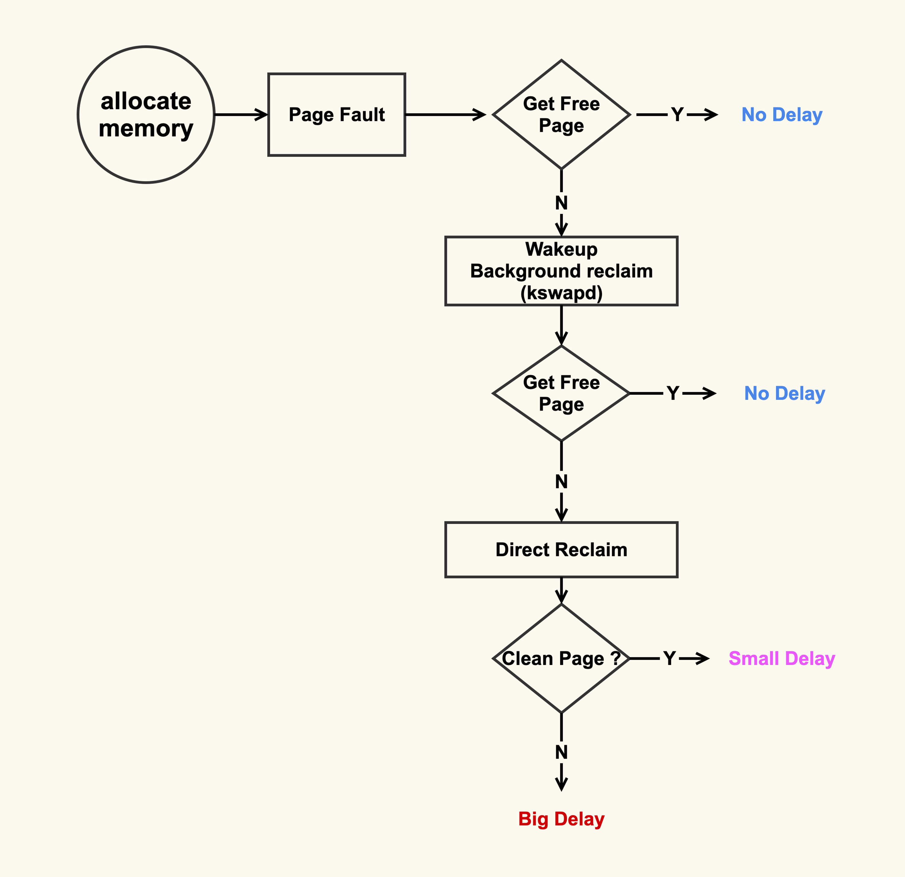

# CPU

# 内存

## page cache


- page cache 属于内核内存，不属于用户态
- 标准 I/O 和内存映射 I/O 会使用 page cache，减少 I/O 读写次数，而直接 I/O 直接操作磁盘


### 如何查看 page cache

可以使用 `/proc/meminfo` 或者 `free -k` 

```sh
$ cat /proc/meminfo
...
Buffers:            1224 kB
Cached:           111472 kB
SwapCached:        36364 kB
Active:          6224232 kB
Inactive:         979432 kB
Active(anon):    6173036 kB
Inactive(anon):   927932 kB
Active(file):      51196 kB
Inactive(file):    51500 kB
...
Shmem:             10000 kB
...
SReclaimable:      43532 kB
...
```

> page cache = Buffers + Cached + SwapCached = Active(file) + Inactive(file) + Shmem + SwapCached

- 左边右边。。

```sh
$ free -k
              total        used        free      shared  buff/cache   available
Mem:        7926580     7277960      492392       10000      156228      430680
Swap:       8224764      380748     7844016
```

其中，

> buff/cache = Buffers + Cached + SReclaimable

- buff/cache：
- SReclaimable


## SwapCached

https://blog.csdn.net/zqz_zqz/article/details/80333607

## page cache 的产生/分配

page cache 产生有两种方式：

- Buffered I/O（标准 I/O）；
- Memory-Mapped I/O（存储映射 I/O）



## page cache 的消亡/回收

### 如何观察 page cache 的回收

## Dirty page 脏页 和 Clean page

## page cache 引发的问题

有时候发现系统 load 飙高，通常的原因一般是：

- 直接内存回收导致的 load 飙高
- 脏页积压过多引起的 load 飙高
- NUMA 策略配置不当引起的 load 飙高


### 直接内存回收导致的 load 飙高




### 脏页积压过多引起的 load 飙高

### NUMA 策略配置不当引起的 load 飙高

## 磁盘 I/O

## 网络 I/O


