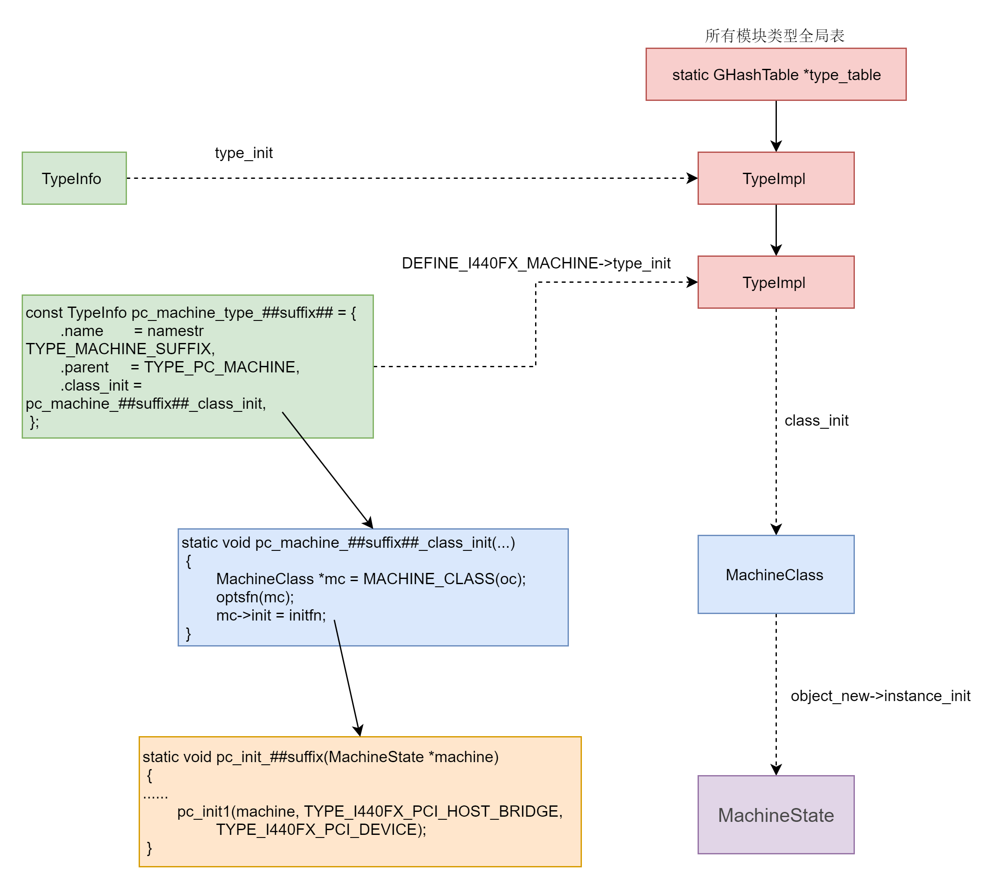
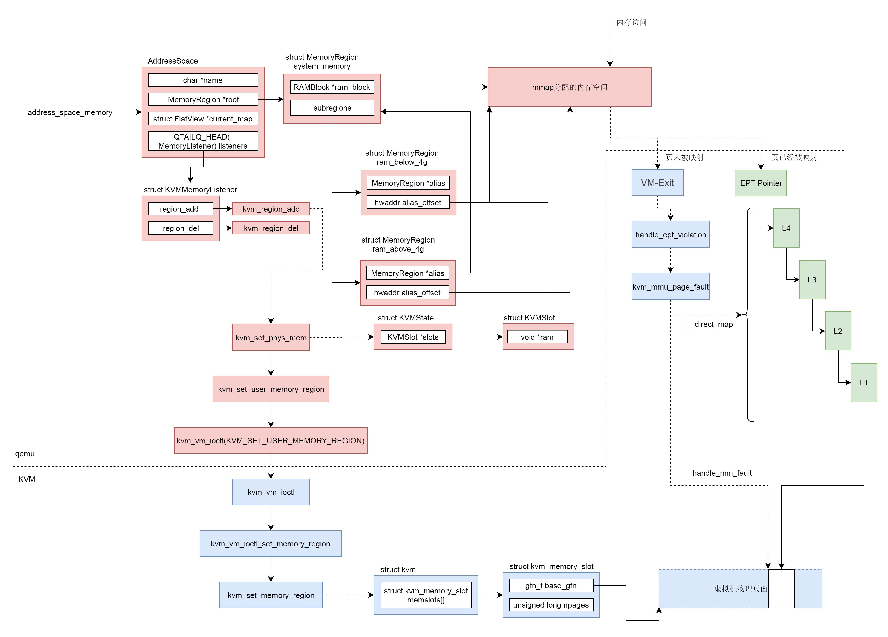

## 50 计算虚拟化之 CPU

本节来看下用户态的 Qemu 和 内核态的 kvm 如何一起协作，来创建虚拟机，实现 CPU 的虚拟化。

Qemu 启动的一般命令：

```sh
qemu-system-x86_64 -enable-kvm -name ubuntutest  -m 2048 -hda ubuntutest.qcow2 -vnc :19 -net nic,model=virtio -nettap,ifname=tap0,script=no,downscript=no
```


qemu 的 main 函数在 vl.c 下面，第一步初始化所有的 Module，调用：

```
module_call_init(MODULE_INIT_QOM);
```

qemu 为了模拟各种各样的设备，需要管理各种各样的设备，定义一个 qemu 模块会调用 type_init，每个模块会顶一个 TypeInfo，会通过 type_init 变为全局的 TypeImpl。整个关系图如下所示：




## 51 计算虚拟化之 CPU （下）

CPU虚拟化的大体过程：

- 定义 CPU 类型的 TypeInfo 和 Typelmpl，继承关系，并且声明它的类型初始化函数
- 在 qemu 的 main 函数中调用 MachineClass 的 init 函数，这个函数既会初始化 CPU 也会初始化内存。
- CPU 初始化的时候，会调用 pc_new_cpu 创建一个 CPU，他会调用 CPU 类的初始化函数
- 每个 VCPU 会调用 qemu_thread_create 创建一个线程，线程的执行函数为 qemu_kvm_cpu_thread_fn
- 其中会调用 kvm_vm_ioctl(KVM_CREATE_VCPU)，在内核的 KVM 里面，创建一个结构 struct vcpu_vmx，表示这个虚拟 CPU。
- 接着调用 kvm_vcpu_ioctl(KVM_RUN)，在内核的 KVM 里面运行这个虚拟机 CPU。

## 52 计算虚拟化之 内存虚拟化

虚拟机内存包括：

- 虚拟机里面的虚拟内存（GVA）：这是虚拟机里的进程看到的内存空间
- 虚拟机里的物理内存（GPA）：这是虚拟机里面的操作系统看到内存，虚拟机物理内存
- 物理机的虚拟内存（HVA）：这是物理机的 qemu 进程看到的内存空间
- 物理机的物理内存（HPA）：这是物理机上的操作系统看到的内存


虚拟机的内存管理也需要用户态的qemu和内核态的 KVM 共同完成，为了加速内存映射，需要借助硬件的 EPT 技术。



