[TOC]


## 第 1 课 网络协议一览

OSI 七层协议：

从下到上：物理层、数据链路层、网络层、传输层、会话层、表示层、应用层。

- 会话层：区分不同的应用，比如图片，声音，视频等；
- 表示层：定义语义语法，编码压缩规范，如律师有职业用语，喷子有专门的调子。
- 应用层：上面两层通常和应用层合为一体，定义具体的应用形态，数据格式，例子：用于 Web 的 HTTP 协议（安全 HTTPS），用于传输文件的 FTP 协议，用于 Email 的 IMAP 协议等。

应用层：DHCP、HTTP、HTTPS、DNS、HTTPDNS（更为精准）、RPC（进程级别的通信）、FTP、IMAP

传输层：TCP、UDP

网络层：ICMP、IP、OSPF、BGP、IPSec、GRE

链路层：ARP、RARP、VLAN、STP


## 第 2 课 网络分层

复杂的程序都需要分层，这是程序设计的要求。

网络通信中，可以有下层没上层，但不能有上层没下层。


## 第 3 课 ifconfig 与 IP 地址分类

Windows：ipconfig
Linux：ifconfig

ifconfig vs ip addr -> net-tools vs iproute2
`net-tools` 系工具目前很多 Linux 发行版都已不在提供，建议重点掌握 `iproute2`，但很多老系统仍然常用 net-tools 系，需要两个都得熟悉。

**重点：** `net-tools` 通过 `procfs(/proc)` 和 `ioctl` 系统调用区访问和改变内核网络参数配置实现网络功能，而 `iproute2` 则是通过 `netlink` 套接字直接与内核通信（性能上会占优）。

A、B、C 三类地址包含的主机数量：


最右一栏显示了私有地址，这就是平常我们在办公室、家里和学校里常配的 IP 地址。

缓解 IPv4 地址耗尽的两种临时解决方案：CIDR、NAT。

```sh
root@ubuntu:~# ifconfig
enp0s3    Link encap:Ethernet  HWaddr 08:00:27:2d:63:18
          inet addr:192.168.0.109  Bcast:192.168.0.255  Mask:255.255.255.0
          inet6 addr: fe80::a00:27ff:fe2d:6318/64 Scope:Link
          UP BROADCAST RUNNING MULTICAST  MTU:1500  Metric:1
          RX packets:73 errors:0 dropped:0 overruns:0 frame:0
          TX packets:62 errors:0 dropped:0 overruns:0 carrier:0
          collisions:0 txqueuelen:1000
          RX bytes:8927 (8.9 KB)  TX bytes:9019 (9.0 KB)
```
网络设备的状态标识：

```
<BROADCAST, MULTICAST, UP, LOWER_UP>
```
- UP：表示网卡处于启动状态
- BROADCAST：表示网卡可以发送广播
- MULTICAST：表示网卡可以发送多播
- LOWER_UP：表示 L1 是启动的，也即网线是插着的

- MTU 1500：以太网默认的最大传输单元（以太网头部+正文部分）。注意和传输层的 MSS（最大报文段）的区别。

- `qdisc pfifo_fast`：网卡队列排队规则。`pfifo` 最简单的规则，数据包先进先出。`pfifo_fast` 稍微复杂，队列包括三个波段（band），在每个波段里，同样采用先进先出。数据包按照 `TOS（Type of Service）` 被分配到三个波段。
- `TOS `指明了当前数据包的优先级。
- 网络收发的字节数、包数、错误数以及丢包情况，特别是 TX 和 RX 部分的 errors、dropped、overruns、carrier 以及 collisions 等指标
  - errors：表示发生错误的数据包数，如校验错误、帧同步错误等
  - dropped：表示丢弃的数据包数，（包已经到了接收队列的 ring buffer，但因为内存不足等原因丢包）
  - overruns：表示超限数据包数，网络 I/O 速度过快，导致 ring buffer 中数据包来不及处理而导致丢包
  - carrier：表示发生 carrier 错误的数据包数，比如双工模式不匹配，物理电缆出现问题等
  - collisions：表示碰撞数据包数


## 第 4 课 IP 地址与 DHCP
ip 配置：

ifconfig：
```
sudo ifconfig eth0 10.0.0.1/24
sudo ifconfig eth0 up
```

ip addr:
```
sudo ip addr add 10.0.0.1/24 dev eth0
sudo ip link set up eth1
```

DHCP 自动配置 IP 地址：
采用租约（租房）地址的方式，便于网络管理。

工作方式：
1. `DHCP Discover` ：首次接入的 Client 终端广播。广播包 src 是：0.0.0.0，dst 是 255.255.255.255，使用 UDP，UDP 封装 `BOOTP` （BOOTP 是 DHCP 的加强版）。


2. `DHCP Offer`：DHCP Server 广播。广播包 src 是：DHCP Server 的 IP，dst 是 255.255.255.255，封装包携带了分配的 IP 地址。


3. `DHCP Request`：Client 接受到 IP 地址后广播（如果存在多个 DHCP Server，则 Client 可能收到多个 IP，它会选择最先到达的一个）。广播包 src 是 0.0.0.0，dst 是 255.255.255.255，封装包携带 Client 接受的 IP，以及接受租约的 Server 的 IP 等信息，目的是告诉众多 Server 它已租到地址，租到谁的地址，对没有接受的 Server 可以撤销它们提供的地址。


4. `DHCP ACK`：DHCP Server 广播（给 Client 确认地址及租期等信息，同时告知其余角色这个 IP 已给某人）。广播包 src 是：DHCP Server 的 IP，dst 是 255.255.255.255，封装包携带租期等信息。


5. IP 地址的收回与续租

当 Client 租期过去 50% 的时候，会直接向给它提供 IP 的 DHCP Server 发送 `DHCP Request` 包，Server 会根据 Request 更新租期及其他 TCP/IP 参数，向 Client 发送 `DHCP ACK` 包，Client 也会据此更新自身的配置。

## 第 5 课 MAC 地址与 ARP

解决：发给谁，出现拥堵怎么办？即多路访问拥堵的问题

MAC 层多路访问算法：

- 信道划分：你走你的，我走我的
- 轮流协议：今天单号出行，明天双号出行
- 随机接入协议：不管三七二十一，有事先出门，发现特堵，就回去，错过高峰再出

MAC 数据包格式：


ARP：MAC 地址解析

ARP 报文格式：


RARP：反向地址解析，根据 MAC 求 IP。

常用在一些无盘工作站（没有硬盘，无法保存 IP 地址，但是有唯一的 MAC 地址），这时可以通过 RARP 根据 MAC 请求 IP，这个操作同样也可以使用 DHCP 或 BOOTP。所以，RARP 一般不常用。

Hub 和 交换机的区别：
Hub：

1. 一个广播域，一个冲突域
2. 传输数据过程中易产生冲突，带宽利用率不高
3. 每次数据传输都是全部端口转发，没有学习功能

Switch：
1. 在划分 vlan 的前提下可以实现多个广播域，每个接口都是一个单独的冲突域。
2. 通过自我学习的方法可以构建出 CAM 表（MAC 地址表，Content Addressable Memory），并基于 CAM 表进行数据转发。
3. 支持生成树算法，可以构建出物理有环，逻辑无环的网络，网络冗余和数据传输效率都甩 Hub 好几条街。

## 第 6 课 交换机和 VLAN
交换机环路问题：

最典型的场景是：两个交换机分别连接两个 LAN，如下：


破解环路问题：SPT，Spanning Tree Protocol，最小生成树算法


概念：
- `Root Bridge`：根交换机，掌门，某棵树的老大。
- `Designated Bridges`：指定交换机，一棵树的树枝，由老大指定的管事的人。
- `Bridge Protocol Data Units(BPDU)`：网桥协议数据单元。各交换机之间协商的协议（比较实力），BPDU 只有掌门能发，已经隶属于某个掌门的交换机只能传达掌门的指示。
- `Priority Vector`：优先级向量。比喻为实力（值越小实力越强）。`<Root Bridge ID, Root Path Cost, Bridge ID, and Port ID>`，一层层的比较（Root Bridge ID 比较是否隶属于同一个掌门，Root Path Cost 比较和掌门的关系，Bridge ID 比较自身的实力）

**STP 的工作过程：**

把一个个的交换机看作是江湖上各大武林高手，通过互相比武的方式来统一江湖。


掌门->同门->小弟

只有掌门可以发 BPDU，刚开始所有人都可以发。
Bridge ID 越小，优先级越高（管理员事先会根据交换机的价格等因素配置不同的优先级）。

工作过程其实就是通过不断的相遇、比较、合并来最终统一这棵树。（不同门派的掌门相遇，同门相遇，不同门派小弟相遇等，通过比较 `Priority Vector` 来决定）

这个例子具体参见课程描述，一看就懂！

**STP 的缺点：**

1. 计算量大，特别是对于跨地域和跨国的网络形态。

2. 没有负载分担，因为有一条链路会被阻塞，不能很好的分担网络负载，cisco 的 `PVST+` 对此作了改进。 

**VLAN 的报文格式：** 


在配 VLAN 的交换机中，连终端的是 Access 口，连交换机的是 Trunk 口。

## 第 7 课 ICMP、ping 与 traceroute
ICMP 报文格式：


ICMP 报文类型：
- 查询报文类型：主动请求，如 `ping`，请求包为 `ICMP ECHO REQUEST`，应答包为 `ICMP ECHO REPLY`。
- 差错报文类型：被动报告差错类型（终点不可达是 3，源抑制是 4，超时是 11，重定向是 5），
  - 终点不可达包括网络不可达、主机不可达、协议不可达、端口不可达、需要进行分片但设置了不分片位。
  - 源抑制是让源站放慢发送速度；
  - 超时是超过网络包的生存时间还没到；
  - 路由重定向是下次发给另一个路由器。

查询报文的使用例子：`ping` 发送与接收过程：


根据 `ping` 包的网络排查过程：
1. 知道 `ping` 包路径上经过哪些节点，画出拓扑图
2. 根据拓扑图中的每个节点执行抓包 `tcpdump -i eth0 icmp` 查看 ICMP 包的信息
3. 有些设备是禁 `ping`，ping 不同不代表网络不通，这个时候需要借助 `telnet` 之类的工具排查。

差错报文的使用例子：`traceroute`：
1. 通过设置路径 TTL 的方式获取路径上路由器的 IP（从 1 逐渐递增）
2. 主动知晓目的主机的不可达信息（错误设置一个不可能的值作为 UDP 端口号，如大于 30000，当到达目标时，会产生“端口不可达的”错误ICMP报文）
3. 通过设置不分片来确定路径的 MTU（故意设置不分片，中间卡住会发 ICMP 网络差错包）
4. 发送 UDP 包

## 第 8 课 NAT 网关
MAC 头和 IP 头：


网关类型：
- 转发网关：不改变 IP 地址的网关
- NAT 网关：改变 IP 地址的网关

可以通过：`https://www.whatismyip.com/` 查看自己 IP 的出口 IP 地址（公网地址）

**扩展：** 

NAT 又分为基础 NAT 和 NAPT。

基础 NAT 就是一对一（一个私有地址对应一个全球地址）；

NAPT 就是一个（或者多个但少量的）外部 IP 和大量的端口号，对应多个内部的 IP 以及相应的端口号，这种方式大大减少了对全球 IP 地址的需求。

 DNAT 和 SNAT：

- SNAT： 源地址转换
- DNAT：目的地址转换

## 第 9 课 路由协议 RIP、OSPF、BGP

配置静态路由：
```
ip route add 192.168.10.0/24 via 192.168.10.1 dev eth0
```

动态路由靠 RIP，OSPF 之类的协议自动配置。

**普通路由** ：根据 IP 来配置路由

**策略路由** ：除了根据 IP 配置，还可以根据多个参数来配置（入口设备、TOS 等），使得从不同来源的包走不同的路由

比如：
```sh
ip rule add from 192.168.1.0/24 table 10
ip rule add from 192.168.2.0/24 table 20

# 表示从 192.168.1.0/24 网段来的包走 table 10 中的路由表，从 192.168.2.0/24 网段来的包走 table 20 中的路由表
```

在一条路由规则中，也可以走多条路径，例如：
```sh
ip route add default scope global nexthop via 100.100.100.1 weight 1 nexthop 200.200.200.1 weight 2
```


**动态路由：** 

基于两种算法 Bellman-Ford 和 Dijkstra 算法

- **Bellman-Ford** ：距离矢量路由算法，路由表保存两个信息：到达目标的路线出口和距离，**缺点** ：1）好消息传得快，坏消息传得慢（类比一个走丢了到处问人）；2）规模不能太大，RIP 采用这种算法，规模限定在 15 hop 以内。
- **Dijkstra** ：链路状态路由算法，代表：OSPF。邻居发送链路状态来感知整个网络拓扑，从而根据 Dijkstra 算法来计算两点间的最短路径。**优点** ：1）只广播或更新改变的网络拓扑，节省了带宽和 CPU 利用率。2）一旦节点挂了，邻居会广播这个消息，坏消息也能迅速收敛; **缺点** ：1）计算量大，每次状态更新都要计算最短路径；2）需要存储空间大。

**OSPF：** 

OSPF 基于 Dijkstra 算法求最短路径，来通告邻居状态消息。如果发现存在多条最短路径，则可以做负载均衡，称为 **等价路由**。（一般应用的接入层有会负载均衡 LVS，可以和 OSPF 一起，实现高吞吐量的接入层设计）


**BGP：**

采用路径矢量算法，是距离矢量算法的升级版，用于各个自治域 AS 之间的通信。

**AS：**

- **Stub AS** ：对外只有一个 AS，这类 AS 不会传输其他 AS 的包，例如，个人或者小公司的网络。
- **Multihomed AS** ：可能有多个连接连到其他 AS，但是大多拒绝帮其他 AS 传输包。例如一些大公司的网络。
- **Transit AS** ：有多个连接连到其他 AS，并且可以帮其他 AS 传输包，例如主干网。


**BGP** ：eBGP 和 iBGP，eBGP 负责 AS 之间的通信，iBGP 则负责 AS 内部的通信

**BGP 基于 TCP，OSPF 基于 UDP，RIP 基于 UDP。** 

## 第 10 课 UDP 协议

网络传输是以包为单位的，二层叫帧，网络层叫包，传输层叫段，我们笼统称为包。

UDP 包头格式：


**QUIC** （Quick UDP Internet Connections，快速 UDP 互联网协议）是 Google 提出来的一种 **基于 UDP 改进的通信协议** ，其目的是降低网络通信的延迟，提供更好的用户互动体验。  Quic 在应用层上，会自己实现快速连接建立、减少重传时延、自适应拥塞控制。

应用场景：
- 网页或APP的访问：Quic
- 流媒体协议（直播）：RTMP
- 实时游戏：长连接
- IoT 物联网：Google Next 建立了 Thread Group，推出了物联网通信协议 Thread，就是基于 UDP 协议
- 移动通信领域：4G 网络中，移动流量上网的数据面对的协议 GTP-U 是基于 UDP 的。

## 第 11 课 TCP 协议（上）

TCP 包头格式：


TCP 的可靠性体现在以下几个方面：

- 顺序问题，稳重不乱
- 丢包问题，承诺靠谱
- 连接维护，有始有终
- 流量控制，把握分寸
- 拥塞控制，知进知退


TCP 三次握手：


TCP 四次挥手：


TCP 状态机
将连接建立和连接断开的两个时序状态图综合起来，就是 TCP 的状态机。


## 第 12 课 TCP 协议（下）

TCP 的几大问题：

- 顺序问题：给每个包分配一个 ID，累计确认或累计应答
- 丢包问题：快速重传、自适应重传
- 流量控制问题：滑动窗口（发送方和接收方都会维持该窗口）
- 拥塞控制问题：拥塞避免算法


滑动窗口机制：

发送方和接收方分别维护着一个滑动窗口，用来记录数据包的发送和接收情况。如下：


对于拥塞控制问题，Google 曾提出了 TCP BBR 拥塞算法：


## 第 13 课 套接字 Socket

从数据结构看 socket 在协议栈中的结构：

如下，socket 是一个文件，对应就有文件描述符，每个进程由数据结构 `task_struct` 来定义，里面指向的是一个文件描述符组，列出这个进程打开的所有文件的文件描述符。

接着通过 `struct socket`，将数据转换成 `struct sk_buffer`，放入 `发送队列`中，反过来，接收到的包就放入 `接收队列` 中。


通信模型：

01 多进程模型


复制了文件描述符列表

02 多线程模型


文件描述符，进程空间是共享的，只是多了一个引用而已。

03 I/O 多路复用 select 主动轮询（一个线程维护多个 socket）

04 I/O 多路复用 epoll 事件回调


## 第 14 课 HTTP 协议

HTTP 请求报文的格式：


QUIC 协议：

HTTP 2.0 相比 HTTP 1.0，减少了 TCP 连接数对服务器性能的影响，加快了页面组件的传播速度。但 HTTP 2.0 由于基于 TCP 协议，传输效率还是较为低下。

QUIC 的几大机制：

- 机制一：自定义连接机制，不像 TCP 连接使用四元组，QUIC 使用的是 **一个 64 位的随机数 ID** 来标识一次连接，然后基于 UDP，这样，就不需要像 TCP 那样连接端点切换（WIFI 或移动网络切换）时就要重新建立连接。
- 机制二：自定义重传机制，QUIC 的序号不管对方有没有回应，都是递增的。
  - 
- 机制三：无阻塞的多路复用
- 机制四：自定义流量控制
  - 

## 第 15 课 HTTPS 协议

### HTTPS 的工作模式

HTTPS 基于 SSL 协议，握手过程也是基于 SSL 的三次握手协议，如下：


## 第 16 课 流媒体协议

讲到了一个 CDN 内容分发网络：包括中心和边缘两层。

边缘层服务器部署在全国各地及横跨各大运营商里，和用户距离很近。中心层是流媒体服务集群，负责内容的转发。智能负载均衡系统，根据用户的地理位置信息，就近选择边缘服务器，为用户提供推 /拉流服务。中心层也负责转码服务，例如，把 RTMP 协议的码流转换为 HLS 码流。


## 第 17 课 P2P 协议

集中式文件的下载方式：

HTTP + FTP

P2P 有两种方式：

- 基于 tracker 的集中式
- 去中心化的完全分布式

## 第 18 课 DNS 协议

DNS 服务器——网络地址簿

DNS 服务器，一定要设计成高可用、高并发和分布式的

一般呈现这样的树状结构：


- 根 DNS 服务器 ：返回顶级域 DNS 服务器的 IP 地址
- 顶级域 DNS 服务器：返回权威 DNS 服务器的 IP 地址
- 权威 DNS 服务器：返回相应主机的 IP 地址


DNS 查询过程如下所示：


- 本地 DNS 服务器：一般在网络服务商（ISP）的机房，由 ISP 分配
- 根域名服务器：分布在全球，共有 13 套
- 顶级域名服务器：分不同区管理，如 .com，.cn 等
- 权威域名服务器：更具体的域名管理


**DNS 做负载均衡：** 

- 内部负载均衡
  - 访问多个应用，部署多个，每次返回不一样的地址，实现负载均衡
- 全局负载均衡
  - 一个 IP 可以管多个服务器，轮询查询多个服务器


具体的过程可以见下图：


两层的负载均衡的意义在于能够就近找到对应的地址。

GSLB：Global Server Load Balance，全局负责均衡器


## 第 19 课 HTTPDNS

传统 DNS 存在的问题：

1. 域名缓存问题（当缓存位置改变时，没有更新页面，访问到还是旧的缓存，或者当访问者的位置改变，依然推荐旧的缓存位置，就不是最优的访问路径）
2. 域名转发问题（跨运营商域名转发解析，A 运营商偷懒，将域名解析请求发给 B 运营商，造成不必要的跨运营商访问开销）
3. 出口 NAT 问题（出口 NAT，导致域名解析误判）
4. 域名更新问题（时间的快慢影响 DNS 的解析，从而影响用户的访问）
5. 解析延迟问题（递归遍历多个 DNS 服务器，导致解析超时）


HTTPDNS 的工作模式：

自己搭建基于 HTTP 协议的 DNS 服务器集群，分布在多个地点和多个运营商。当客户端需要 DNS 解析的时候，不走传统的 DNS 解析，而是直接通过 HTTP 协议进行请求这个服务器集群，得到就近的地址。

要使用 HTTPDNS，需要客户端支持 HTTPDNS 的客户端 SDK。

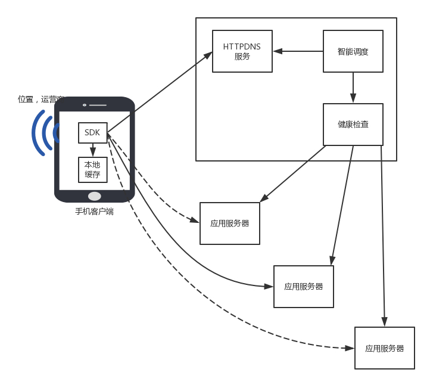


HTTPDNS  解决了两大问题：

- 解析速度和更新速度的平衡问题（缓存设计）
- 智能调度的问题（调度设计）

HTTPDNS 的缓存设计：

分为：客户端-》DNS 缓存-》 HTTPDNS 服务器

Cache-Aside 机制：

先读缓存，不命中读数据库，同时将结果写入缓存。


HTTPDNS 的调度设计：

客户端掌握所有的信息，可以实现全局调度。


## 第 20 课 CDN

CDN 分发系统架构：


CDN 主要缓存静态资源，也有流媒体资源，可以结合 DNS 做负载均衡：


书籍推荐：《CDN技术详解》

## 第 21 课 数据中心

数据中心的出入口，由路由器来负责，称为 **边界路由器**

多台服务器占据机架（Rack），当一个机架占满后，就通过 TOR（Top of Rack）交换机把所有机架连接起来。


网卡高可用：

使用 **网卡绑定（bond）** 技术，同时需要 **LACP（Link Aggregation Control Protocol 链路聚合控制协议）** 来支持，将多个网卡合并为一个：


数据中心常见的架构是一种分层的架构，分为 接入层、汇聚层、核心层：

汇聚层管理的区域叫 一个 POD（Point of Delivery）或者叫 可用区 （Available Zone），将多个 POD 连接起来需要 核心交换机。


以上每个 POD 在不同的广播域里面，随着云计算等发展，要求所有的服务器在一个二层网络里面，所以就有 汇聚层上升为核心层，也就是 **大二层** :


整个数据中心的网络架构图如下：

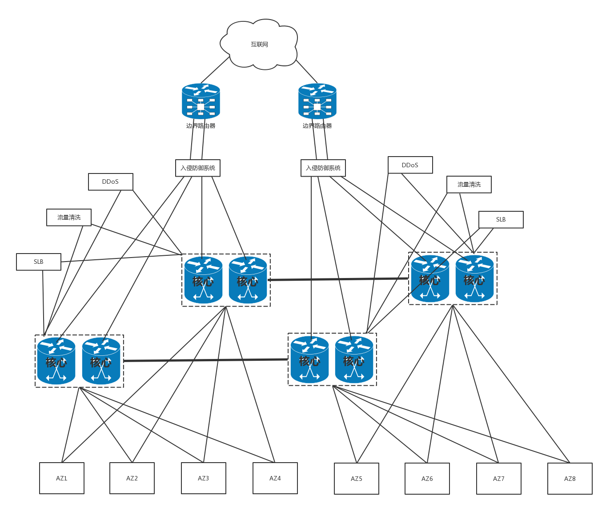

融合了安全防护、负载均衡、边界路由器，软件定义存储等技术。


相对于 三层架构 的另外一种架构是 **叶脊网络（Spine/Leaf）** ：

- 叶子交换机（leaf）：直接连接服务器。
- 脊交换机（spine switch）：核心交换机

叶脊之间通过 ECMP 动态选择多条路径。

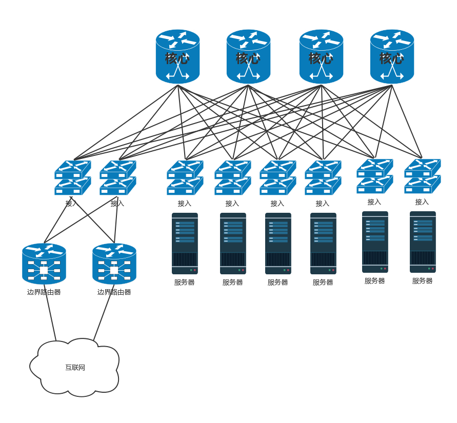

总结：

1. 传统数据中心为垂直架构，通常分为三层：接入层、汇聚层、核心层，最外面连接边界路由器和安全设备
2. 随着云和大数据的发展，东西向流量相对于南北向流量越来越重要，架构逐步演化为：spine-leaf 架构
3. 数据中心的所有链路都需要高可用性。服务器需要绑定网卡，交换机需要堆叠，三层设备可以通过等价路由，二层设备通过 TRILL 协议。


## 第 22 课 VPN

VPN：虚拟专用网

利用开放的公众网络，建立专用数据传输通道，将远程的分支机构、移动办公人员等连接起来。

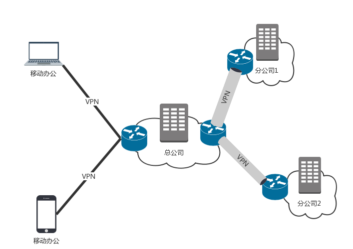

VPN 通过 **隧道** 技术在公众网络上仿真一条点到点的专线，是通过利用一种协议来传输另外一种协议的技术，涉及三种协议：

- 乘客协议
- 隧道协议
- 承载协议

### IPsec VPN 

基于 IP 协议的安全隧道协议


IPsec VPN 协议簇：


IPsec VPN 的封包方案：


IP -> ATM -> MPLS VPN


## 第 23 课 移动网络

2G-> 3G -> 4G -> 5G 

### 2G 

架构图：


- BTS：基站收发信台，对内连接有线网络，对外连接无线网络
- BSC：基站控制器，接收 BTS 发来的无线信号
- RAN：无线接入网
- CN：核心网络，还没有进入 Internet
- MSC：移动业务交换中心，进入核心网的入口
- AUC：鉴权中心
- EIR：设备识别器，负责安全性
- VLR：访问位置寄存器
- HLR：归属位寄存器，两者主要用于计费用


### 2.5G

在 2G 的基础上，多了一个 PCU 分组控制单元，支持 Packet 的转发，支持 IP 网络


- SGSN：GPRS 服务前向支持节点，用于接收 PCU 分组
- GGSN：GPRS 服务后向支持节点，用于转发分组到 Internet


### 3G

以 W-CDMA 为例，基站较于 2G 有所改变：

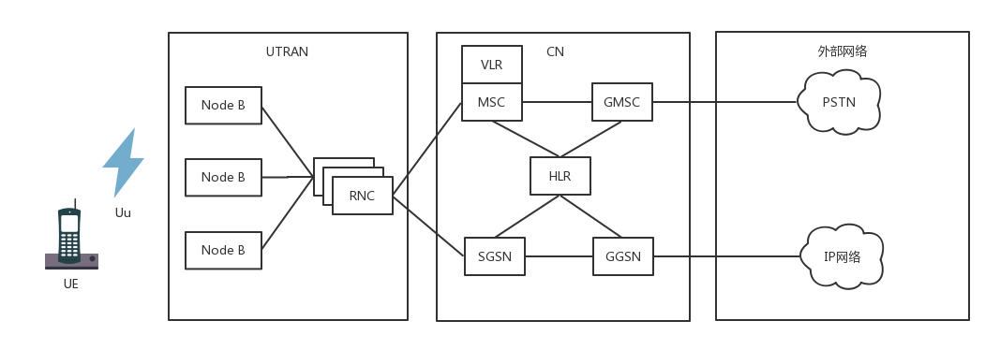


### 4G 

基站为 eNodeB，包含了 NodeB 和 RNC 功能，核心网实现控制面和数据面的分离：


- HSS ：存储用户签约信息的数据库，以及一些认证信息
- MME：核心控制网元，控制面的核心
- SGW+PGW：数据面单元，负责流量转发，PGW 是出口网关
- PCRF：策略和计费控制单元


## 第 24 课 云中网络

虚拟机基于 tap/tun 驱动将数据包发出物理主机流程：


云网络（虚拟机网络）几大特点：

- 共享：共享同一个物理出口
- 隔离：安全隔离和流量隔离
- 互通：同主机、跨主机
- 灵活：经常创建、删除、漂移，灵活配置

### 共享与互通：通过 bridge

桥接：

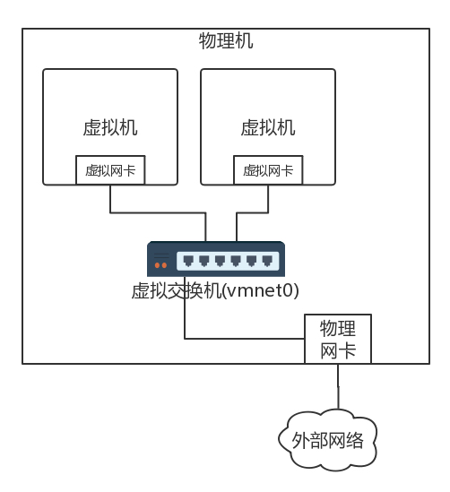

跨主机：

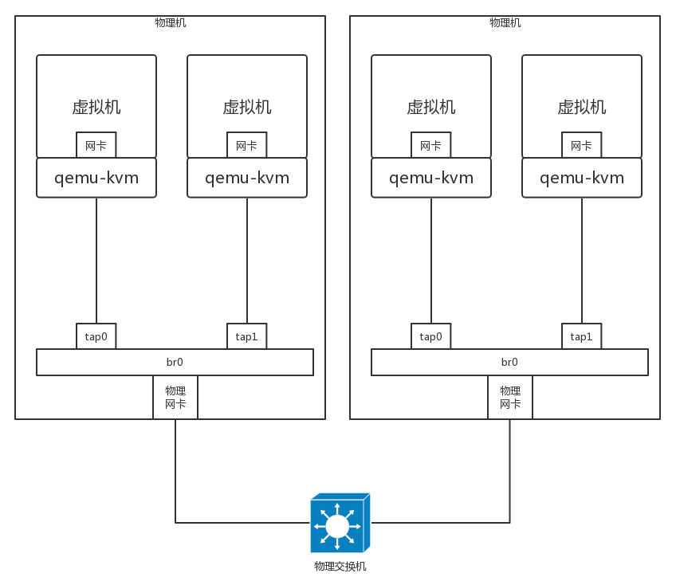


NAT：

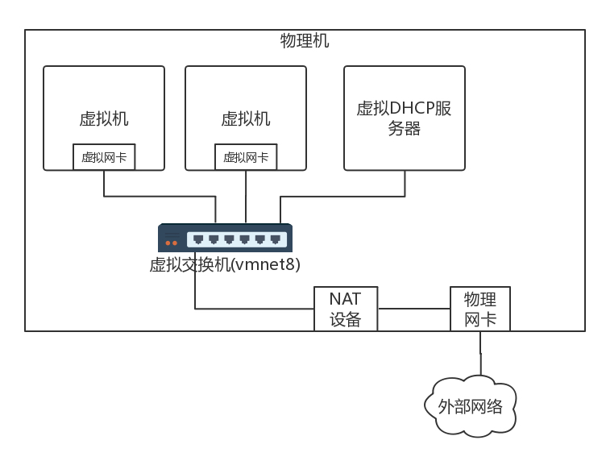

这种情况下，VM网络和主机网络自成体系，所以，VM网络里会内置一个 DHCP 服务器来进行 IP 地址管理。

如果不需要 NAT 和 DHCP 服务，那么可以手动进行 NAT 和 DHCP，即手动配置虚拟机 IP，设置 IPtable 成 NAT，如下：

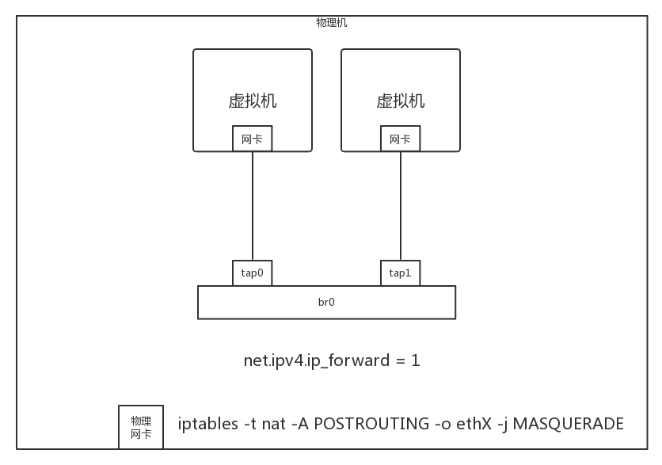


### 隔离


现今的网卡都支持配置子接口，也就是 VLAN，可以使用 `vconfig` 命令配置。

通过 VLAN 可以隔离不同的用户之间的 VM 流量。


## 第 25 课 软件定义网络 SDN


主要有以下三个特点：

- 控制与转发分离
- 控制平面与转发平面之间的开放接口：控制器向上提供的是北向接口，供应业程序调用，向下提供的是南向接口，控制网络设备。
- 逻辑上的集中控制


### OpenFlow 和 OpenvSwitch

OpenFlow 是 SDN 控制器和网络设备之间互通的南向接口协议。

OpenvSwitch 是软件交换机，属于 SDN 的转发面，通过 OpenFlow 协议和 SDN 控制器通信。


SDN 控制器通过 OpenFlow 协议向 OVS 下发流表规则来控制网络设备，流表规则包括 匹配规则、优先级和执行动作：


这里有很多不同类型的规则，包含了 TCP/IP 协议栈的四层，每一层都对应不同的规则，相应地也会执行不同的动作：


OVS 的架构图：

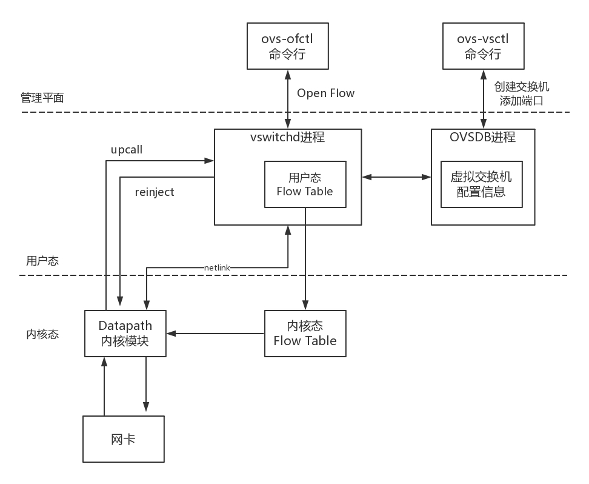


## 第 26 课 云中的网络安全（iptables）

安全策略 ACL 控制 IP 和端口

这些 ACL 规则的集合为安全组。

一个数据包的处理过程通常要经历 5 个节点：

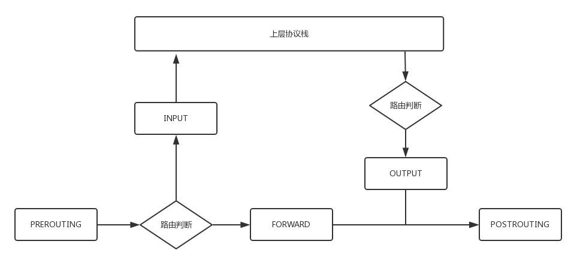


相关的内核模块实现如下：


iptables 的表分为四种：raw->mangle->nat->filter，每个表又可以设置多个链。

比如：

filter 过滤表，包含：

- input 链：过滤所有目标地址是本机的数据包
- forward 链：过滤所有路过本机的数据包
- output 链：过滤所有有本机产生的数据包

nat 表处理网络地址转换，包含：

- prorouting 链：数据包到达防火墙时改变目标地址
- output 链：可以改变本地产生的数据包的目标地址
- postrouting 链：在数据包离开防火墙时改变数据包的源地址

mangle 修改数据包，包含：

- PREROUTING 链； 
- INPUT 链；
- FORWARD 链
- OUTPUT 链
- POSTROUTING 链

丰富上面的图：


## 第 27 课 云中网络的 QoS

Linux 下，可以通过 TC 控制网络的 QoS，就是通过队列的方式。

控制网络的 QoS 的方式：

1、无类别排队规则

- pfifo_fast


- 随机公平队列


- 令牌桶规则


2、基于类别的队列规则

- 分层令牌桶规则


这种规则也是 OVS 常用的一种。


## 第 28 课 云中网络的隔离 GRE、VXLAN

- Underlay 网络：底层的物理网络设备组成的网络
- Overlay 网络：用于虚拟机层面的网络，底层基于物理网络的虚拟网络

隧道技术：

- GRE：


GRE 网络的缺点：

- Tunnel 数量问题，网络越多，所建立的隧道数目呈指数增长
- 不支持组播，都是采用广播
- 目前很多防火墙和三层网络设备无法解析 GRE


VXLAN：


OVS 支持三类隧道：

- GRE
- VXLAN
- IPsec_GRE


## 第 29 课 容器网络

namespace 和 cgroup

通过 NAT 的方式与物理网络进行互通。


## 第 30 课 容器网络之 Flannel

有一个集中注册的地方：


- Flannel 使用 UDP 在用户态的封装实现 Overlay 网络：

  

  

- Flannel 使用 VXLAN 在内核态的封装实现 Overlay 网络：


## 第 31 课 容器网络之 Calico

Calico 网络的大体思路是：不走 Overlay 网络，不引入另外的网络性能损耗，而是将转发全部用三层网络的路由转发来实现。


## 第 32 课 RPC 协议概述

RPC 的调用标准：


这里分了三个层次：

- 用户端和服务端像本地调用一样，专注于业务逻辑的处理。
- Stub 层处理双方约定好的语法、语义、封装、解封装。
- RPCRuntime则是处理高性能的传输，以及网络的错误和异常


NFS 协议就是基于RPC 框架实现的。NFS 运行需要启动两个服务端：mountd（挂载文件） 和 nfsd（读写文件），通过 NFS，可以 mount 一个远程目录到本地一个目录，从而实现在本地操作远程的文件。如下图，其底层实现还是 socket：


## 第 33 课 基于 XML 的 SOAP 协议

XML 定义了一种 RPC 传输的文本类。

这是一种面向对象的文本描述语法，可以灵活地根据自己的需求定义一个对象。

基于 XML 的通信协议，最知名的一个是 SOAP，即简单对象访问协议（Simple Object Access Protocol），它使用 XML 编写简单的请求和回复消息，并用 HTPP 协议进行传输。

通过 Web 服务描述语言 WSDL 来进行协议的约定。

通过 UDDI 统一描述、发现和集成协议来解决服务发现的问题。


## 第 34 课 基于 JSON 的 RESTful 接口协议

JSON 是类似 XML 的一种文本格式。

RESTful API 不仅仅指 API，还是一种架构风格，一种设计风格。主要面向资源，提供无状态服务，有利于横向扩展应对高并发。

## 第 35 课 二进制 RPC 协议

数据中心内部应用之间的调用：


- nginx 充当 API 网关
- Controller 层：具体 API 的实现
- 组合层：复杂业务逻辑实现
- 基础服务层：原子化的接口，缓存和数据库的操作
- 缓存和持久化层：维护数据状态


一个著名的例子是 Dubbo 服务化框架二进制的 RPC 方式：


## 第 36 课 跨语言类 RPC 协议

GRPC 使用 二进制序列化协议是 Protocol Buffers 来传输数据。

## 第 37-39 课 用双十一的例子串讲网络协议

## 第 40 讲 搭建一个网络实验环境

### 环境搭建 

### OVS 实验

OVS 会将自己对于网络的配置保存在一个本地库里面，这个库的表结构关系如下：

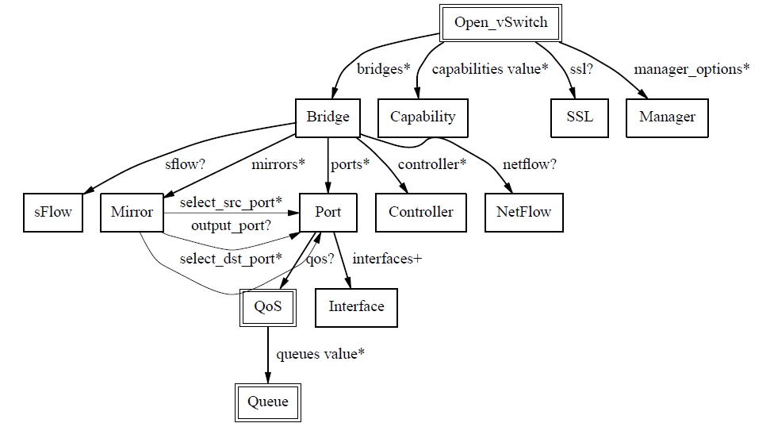

这个库其实就是一个 JSON，打印出来，就是这样：

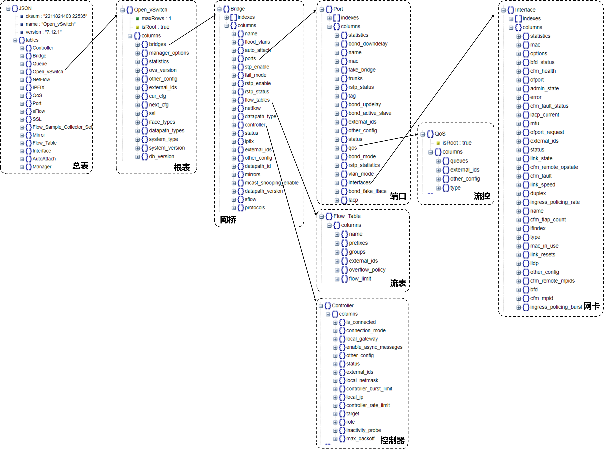

