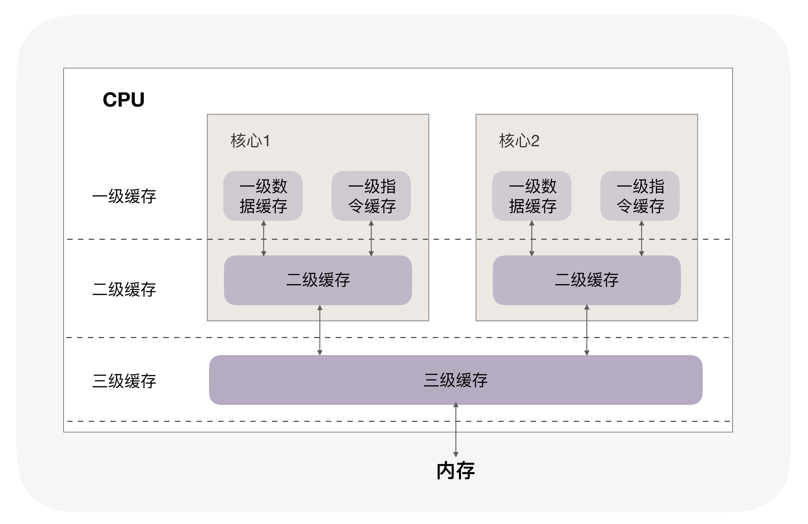

# 基础设施优化

## CPU缓存

### 缓存长什么样？

缓存在 CPU 内部，因此也叫 CPU 缓存，对内存对应。缓存由 SRAM 构成，内存是 DRAM，SRAM 比 DRAM 速度更快，但也贵，且容量较小，内存一般以 GB 衡量，缓存则是以 MB、KB 衡量。

缓存包括 L1、L2、L3级缓存，三者离 CPU 核心的距离依次增大，容量也依次加大，比如：L1 一般 32KB，L2 为 256KB，L3 能到 20MB。

Linux系统查看每级缓存的大小，可以这样：


Windows 上可以使用 wmic cpu 指令，或者用 [CPU-Z](https://www.cpuid.com/softwares/cpu-z.html) 这个工具。

现在 CPU 都是多核心的，每个核心都独享 L1、L2 缓存，L3 则是多个核心共享。如下图所示：



### 缓存的性能用什么指标来评估？

**缓存命中率**用来评估 CPU 的处理性能。

CPU 处理数据，要经历从内存->L3->L2->L1的加载顺序，缓存比内存要快很多，如果能直接从缓存中获取数据，那将大大加大数据处理的速度。

缓存比内存快多少呢？CPU 访问一次内存通常要 100个时钟周期，而访问 L1 要 4-5 个，L2 要 12 个，L3 要 30 个，对于 2GHZ 主频的 CPU 来说，一个时钟周期是 0.5ns。

工具 [Benchmark](https://www.7-cpu.com/) 中可以找到几种典型 CPU 缓存的访问速度。

### 提升缓存的性能需要考虑哪些方面？

从上图可以看到，L1 包括数据缓存和指令缓存，因此，提升缓存性能，需要从提升数据缓存命中率和指令缓存命中率这两方面来看。

#### 提升数据缓存命中率

一个最典型的例子是 二维数组的访问，`a[i][j]` 和 `a[j][i]` 访问数组元素，哪一种方式最快？

这就涉及到数据缓存的问题，因为二维数组在内存中的存放本质上一维数组的展开，顺序像这样：

```
array[0][0]，array[0][1]，array[1][0]，array[1][1] 
```

所以，`a[i][j]` 访问的时候，正好顺应了这种结构，CPU 可以在访问 `a[0][0]` 的时候，顺带也把后面三个元素也缓存了，这就会很快。

而反观 `a[j][i]` 的方式，是跳跃式访问，没办法把后面的元素一次性加载进来，访问就慢。

至于快多少，这个跟 Cache Line 有关，它定义缓存一次性载入数据的大小，通常是 64 字节。这要求数组的大小通常要是 Cache Line 的整数倍，才能充分利用 Cache 的优势。

#### 提升指令缓存命中率

同样一个典型的例子是 一个数组要对它操作和排序，那么是先排序后操作速度快，还是先操作后排序速度快，比如下面 “比较数组的元素是否<128，是就置0” 的操作。

```c
for(i = 0; i < N; i++) {       
    if (array [i] < 128) array[i] = 0; 
} 
sort(array, array +N); 
```

答案是先排序后操作速度快。

原因是 CPU 有分支预测器，当代码中出现 if、switch 等语句时，它会预测代码接下来的行为，可能会在哪段代码中执行（比如是 if 还是 else 指令），如果操作的数组是有序的，那么它就可以根据历史信息准确预测，然后将指令提前加载到缓存中，如果数组无序，那么就很难做预测，CPU 的分支预测器就派不上用场。

Linux 代码中 likely 和 unlikely 函数就利用了 CPU 分支预测器的功能。

```c
#define likely(x) __builtin_expect(!!(x), 1)  
#define unlikely(x) __builtin_expect(!!(x), 0) 
if (likely(a == 1)) … 
```

### 多核环境下如何提升缓存的性能？

单核环境下，CPU 通过时分复用来提供多线程的运行，多核环境下，线程可能在多个核之间“漂移”，造成缓存的失效，所以，一般在多核环境下，要提高缓存性能，都是将线程和 CPU 核心进行亲和性绑定。这样线程就只会一直在其绑定的 CPU 核心上运行，提高缓存的命中率。

Linux 上提供了 sched_setaffinity 方法来实现这一功能，另外，像 OVS、DPDK 这类的程序也提供非常好用的工具来绑核。

### 有什么工具可以查看和操作缓存？

- [CPU-Z](https://www.cpuid.com/softwares/cpu-z.html)：可以查看 Windows 上的缓存大小
- [Benchmark](https://www.7-cpu.com/)：可以查看 CPU 缓存的访问速度
- [perf](http://www.brendangregg.com/perf.html)：查看缓存命中率等参数，这个网址罗列大量的用法


