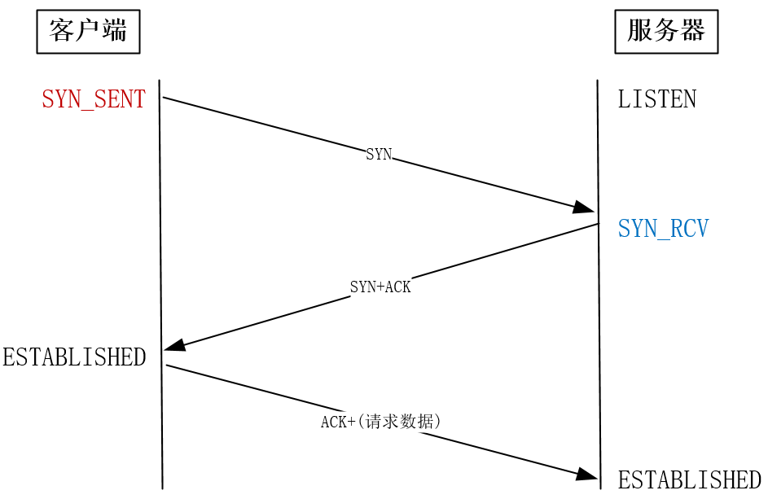
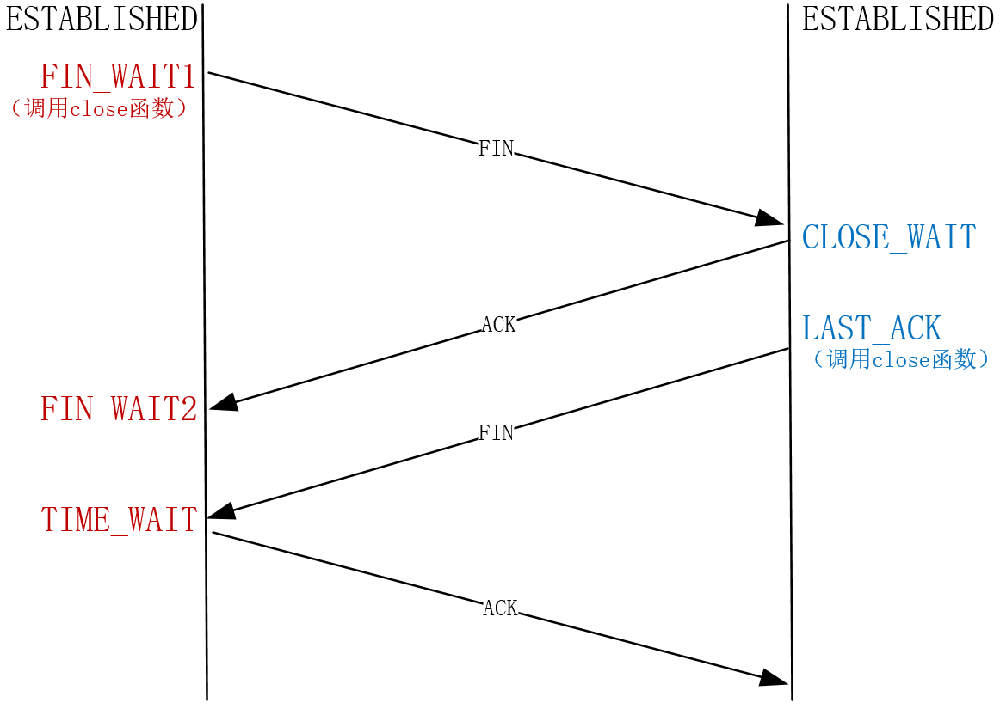

# 基础设施优化

## CPU缓存

### 缓存长什么样？

缓存在 CPU 内部，因此也叫 CPU 缓存，对内存对应。缓存由 SRAM 构成，内存是 DRAM，SRAM 比 DRAM 速度更快，但也贵，且容量较小，内存一般以 GB 衡量，缓存则是以 MB、KB 衡量。

缓存包括 L1、L2、L3级缓存，三者离 CPU 核心的距离依次增大，容量也依次加大，比如：L1 一般 32KB，L2 为 256KB，L3 能到 20MB。

Linux系统查看每级缓存的大小，可以这样：


Windows 上可以使用 wmic cpu 指令，或者用 [CPU-Z](https://www.cpuid.com/softwares/cpu-z.html) 这个工具。

现在 CPU 都是多核心的，每个核心都独享 L1、L2 缓存，L3 则是多个核心共享。如下图所示：


### 缓存的性能用什么指标来评估？

**缓存命中率**用来评估 CPU 的处理性能。

CPU 处理数据，要经历从内存->L3->L2->L1的加载顺序，缓存比内存要快很多，如果能直接从缓存中获取数据，那将大大加大数据处理的速度。

缓存比内存快多少呢？CPU 访问一次内存通常要 100个时钟周期，而访问 L1 要 4-5 个，L2 要 12 个，L3 要 30 个，对于 2GHZ 主频的 CPU 来说，一个时钟周期是 0.5ns。

工具 [Benchmark](https://www.7-cpu.com/) 中可以找到几种典型 CPU 缓存的访问速度。

### 提升缓存的性能需要考虑哪些方面？

从上图可以看到，L1 包括数据缓存和指令缓存，因此，提升缓存性能，需要从提升数据缓存命中率和指令缓存命中率这两方面来看。

#### 提升数据缓存命中率

一个最典型的例子是 二维数组的访问，`a[i][j]` 和 `a[j][i]` 访问数组元素，哪一种方式最快？

这就涉及到数据缓存的问题，因为二维数组在内存中的存放本质上一维数组的展开，顺序像这样：

```
array[0][0]，array[0][1]，array[1][0]，array[1][1] 
```

所以，`a[i][j]` 访问的时候，正好顺应了这种结构，CPU 可以在访问 `a[0][0]` 的时候，顺带也把后面三个元素也缓存了，这就会很快。

而反观 `a[j][i]` 的方式，是跳跃式访问，没办法把后面的元素一次性加载进来，访问就慢。

至于快多少，这个跟 Cache Line 有关，它定义缓存一次性载入数据的大小，通常是 64 字节。这要求数组的大小通常要是 Cache Line 的整数倍，才能充分利用 Cache 的优势。

#### 提升指令缓存命中率

同样一个典型的例子是 一个数组要对它操作和排序，那么是先排序后操作速度快，还是先操作后排序速度快，比如下面 “比较数组的元素是否<128，是就置0” 的操作。

```c
for(i = 0; i < N; i++) {       
    if (array [i] < 128) array[i] = 0; 
} 
sort(array, array +N); 
```

答案是先排序后操作速度快。

原因是 CPU 有分支预测器，当代码中出现 if、switch 等语句时，它会预测代码接下来的行为，可能会在哪段代码中执行（比如是 if 还是 else 指令），如果操作的数组是有序的，那么它就可以根据历史信息准确预测，然后将指令提前加载到缓存中，如果数组无序，那么就很难做预测，CPU 的分支预测器就派不上用场。

Linux 代码中 likely 和 unlikely 函数就利用了 CPU 分支预测器的功能。

```c
#define likely(x) __builtin_expect(!!(x), 1)  
#define unlikely(x) __builtin_expect(!!(x), 0) 
if (likely(a == 1)) … 
```

### 多核环境下如何提升缓存的性能？

单核环境下，CPU 通过时分复用来提供多线程的运行，多核环境下，线程可能在多个核之间“漂移”，造成缓存的失效，所以，一般在多核环境下，要提高缓存性能，都是将线程和 CPU 核心进行亲和性绑定。这样线程就只会一直在其绑定的 CPU 核心上运行，提高缓存的命中率。

Linux 上提供了 sched_setaffinity 方法来实现这一功能，另外，像 OVS、DPDK 这类的程序也提供非常好用的工具来绑核。

### 有什么工具可以查看和操作缓存？

- [CPU-Z](https://www.cpuid.com/softwares/cpu-z.html)：可以查看 Windows 上的缓存大小
- [Benchmark](https://www.7-cpu.com/)：可以查看 CPU 缓存的访问速度
- [perf](http://www.brendangregg.com/perf.html)：查看缓存命中率等参数，这个网址罗列大量的用法

# 系统层网络优化

## 提升 TCP 三次握手的性能

TCP 三次握手，如果存在网络问题，都会存在延迟，导致性能下降，因此 Linux内核提供了相关的参数来优化每一次握手可能存在的情况。



**优化参数一：**

首先是状态 `SYN_SENT` 下如果迟迟收不到对方的 ACK，则会重发，重发次数由参数 ` tcp_syn_retries ` 控制，默认是 6 次。

```sh
net.ipv4.tcp_syn_retries = 6
```

第 1 次重试发生在 1 秒钟后，接着会以翻倍的方式在第 2、4、8、16、32 秒共做 6 次重试，最后一次重试会等待 64 秒，如果仍然没有返回 ACK，才会终止三次握手。所以，总耗时是 1+2+4+8+16+32+64=127 秒，超过 2 分钟。

**优化参数二：**

针对服务端。服务端有两个队列：半连接队列（syn队列）和全连接队列（accept队列）。

问题一：syn队列满了，将会丢掉新连接，怎么办

如何查看该队列满了？看有没有丢包：

```sh
# netstat -s | grep "SYNs to LISTEN"
    1192450 SYNs to LISTEN sockets dropped
```

方法一：可以调大 syn 队列，参数 `tcp_max_syn_backlog` 控制：

```sh
net.ipv4.tcp_max_syn_backlog = 1024
```

方法二：开启 `syncookies` 功能可以在不使用 syn队列的情况下建立连接。

```sh
net.ipv4.tcp_syncookies = 1
# 0 不开启
# 1 仅当syn队列满了再启用
# 2 无条件开启
```


问题二：accept队列满了怎么办

如何看 accept 队列满了？

```sh
# netstat -s | grep "listen queue"
    14 times the listen queue of a socket overflowed
```

方法一：新连接直接发送 RST 关闭连接，参数 `tcp_abort_on_overflow ` 控制

```sh
net.ipv4.tcp_abort_on_overflow = 0
```

方法二：调大队列，参数 ` somaxconn ` 和 listen() 函数的 `backlog` 参数控制：

```sh
net.core.somaxconn = 128
```

**优化参数三：**

服务端如果长时间处于 `SYN_RECV` 状态（没有收到客户端的 ACK），就会一直重发 `SYN+ACK`，这个时长由参数 ` tcp_synack_retries ` 控制：

```sh
net.ipv4.tcp_synack_retries = 5
```

tcp_synack_retries 的默认重试次数是 5 次，与客户端重发 SYN 类似，它的重试会经历 1、2、4、8、16 秒，最后一次重试后等待 32 秒，若仍然没有收到 ACK，才会关闭连接，故共需要等待 63 秒。

## 提升 TCP 四次挥手的性能

socket 编程中的 close() 和 shutdown() 函数都能够触发四次挥手的发生，但两次有一定的差别。close() 函数会让连接变为孤儿连接，之后进程就无法再接收数据，shutdown() 函数则允许在半关闭状态下长时间传输数据。




**优化参数一：**

当主动方长时间处于 `FIN_WAIT1` 时，会重发 FIN 包，重发次数由参数 `tcp_orphan_retries` 控制。重发次数达到时，就会直接关闭连接。

```sh
net.ipv4.tcp_orphan_retries = 0
```

问题：如果`FIN_WAIT1`状态的连接很多，应该适当降低该值。默认值是0，特指8次。

但有些情况 FIN 报文压根发布出去（比如发送缓冲区还有数据没法送时，或者接受方通告的窗口为0），这时就应该考虑参数 ` tcp_max_orphans `：定义了孤儿连接的最大数量（只要进程调用了 close()，无论该连接处于`FIN_WAIT` 状态，还是确实关闭了，都是一个孤儿连接）。

```sh
net.ipv4.tcp_max_orphans = 16384
```

问题：如果孤儿连接大于它，新增的孤儿连接将不再走四次挥手，而是直接发送 RST 报文强制关闭。

这个参数对于被动方重发 FIN 包时也是适用的。

**优化参数二：**

当主动方调用 close() 时成为孤儿连接时，表示主动方通道已经关闭，希望被动方尽快关闭，此时 `FIN_WAIT2` 的状态不宜停留太长，如果调用 shutdown() 关闭则没有这个要求。

这个时间由参数 `tcp_fin_timeout` 控制，默认值是 60s，这意味着对于孤儿连接，如果60s后仍然还没有收到对方的 FIN 报文，连接就会关闭。

这个时间和 `TIME_WAIT` 的时间是一样的。

**优化参数三：**

`TIME_WAIT` 的时长不宜太长，不然占用服务器的资源。有几个参数可以控制。

一个是参数 `tcp_max_tw_buckets`：当 `TIME_WAIT` 的连接数量超过该参数时，新关闭的连接就不再经历 `TIME_WAIT` 而直接关闭。

```
net.ipv4.tcp_max_tw_buckets = 5000
```

当服务器的并发连接增多时，同时处于 `TIME_WAIT` 状态的连接数量也会很多，此时就应该调大该参数的值。但也不是越大越好，毕竟内存和端口号有限。

另一个参数是 `tcp_tw_reuse`，表示可以复用当前的连接给新的连接使用。

```sh
net.ipv4.tcp_tw_reuse = 1
```

当然，要想使 `tcp_tw_reuse` 生效，还得把 `timestamps` 参数设置为 1，它满足安全复用的先决条件（对方也要打开 `tcp_timestamps` ）： 

```sh
net.ipv4.tcp_timestamps = 1
```


